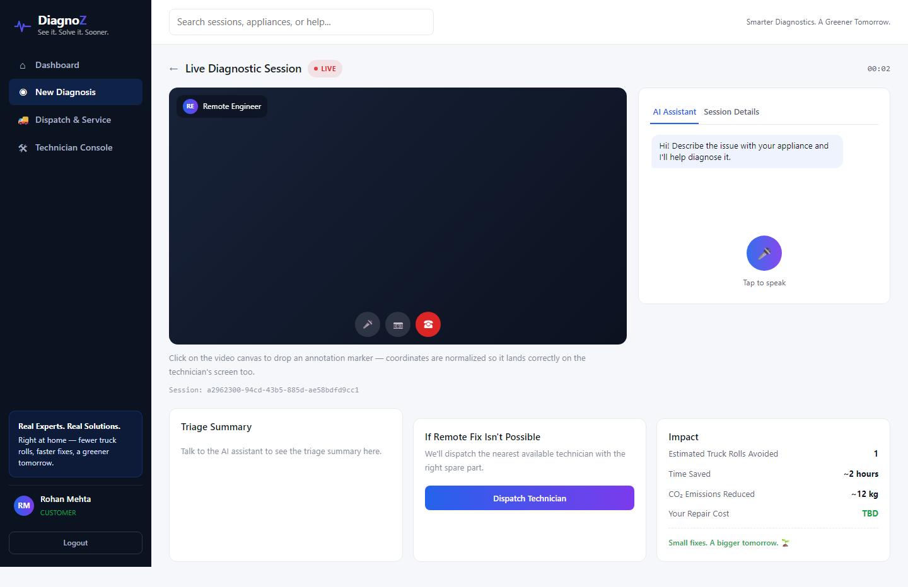
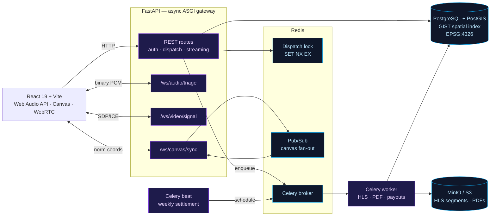
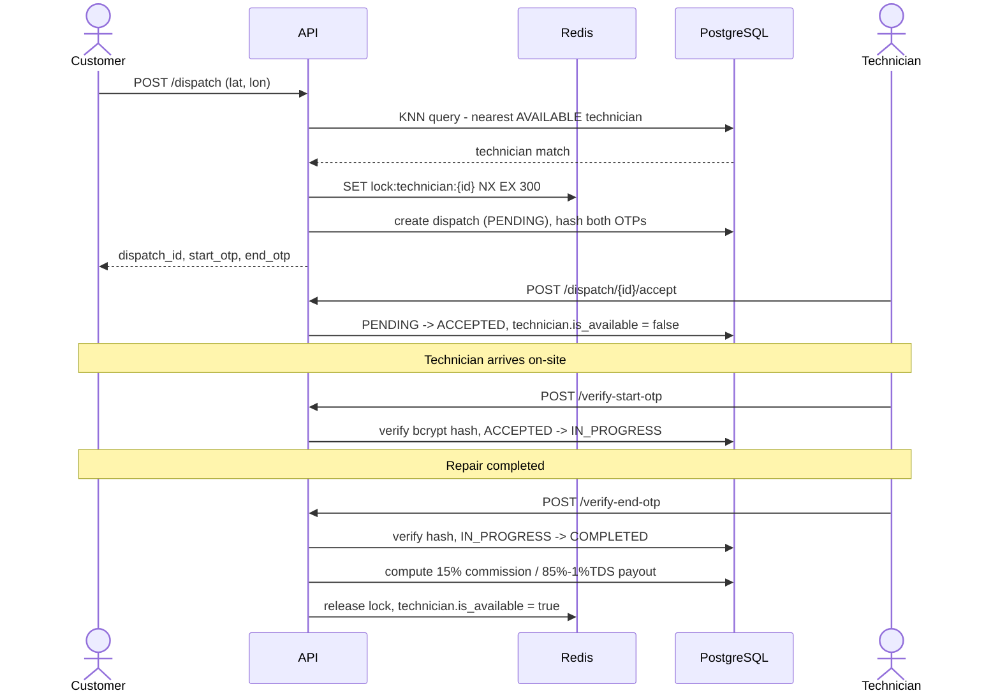
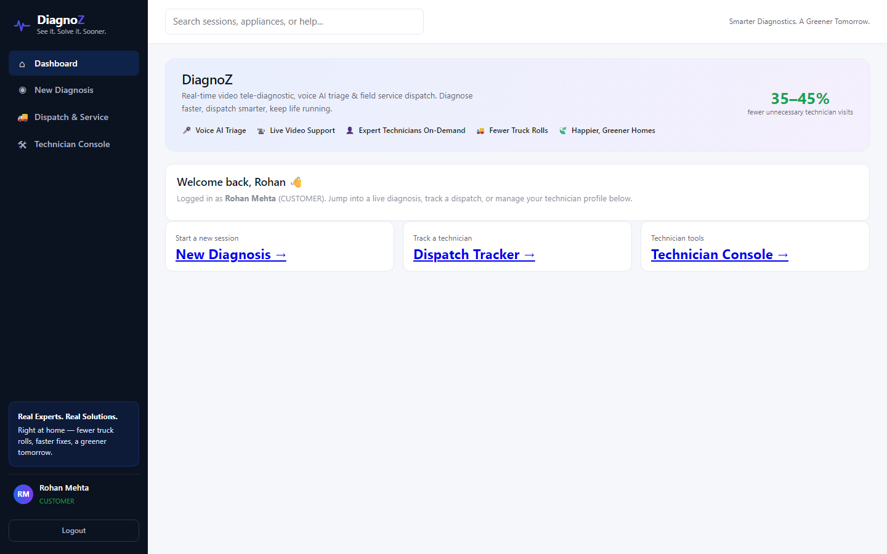
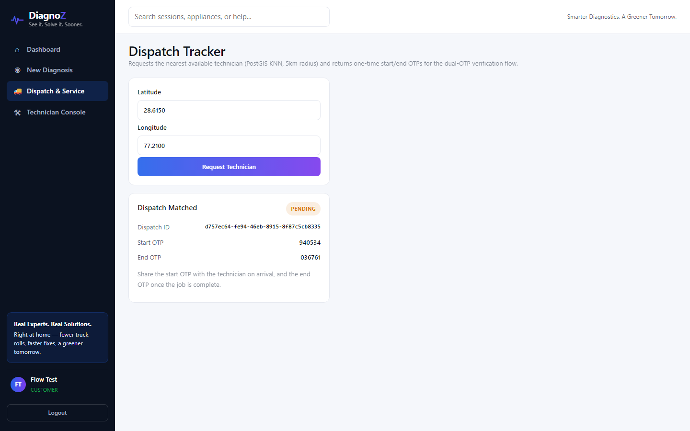
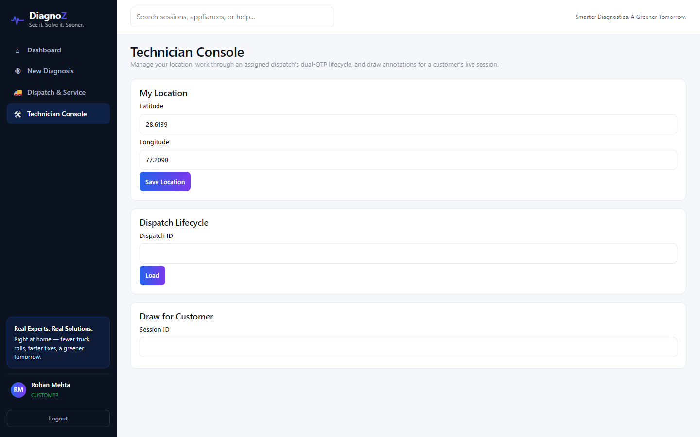
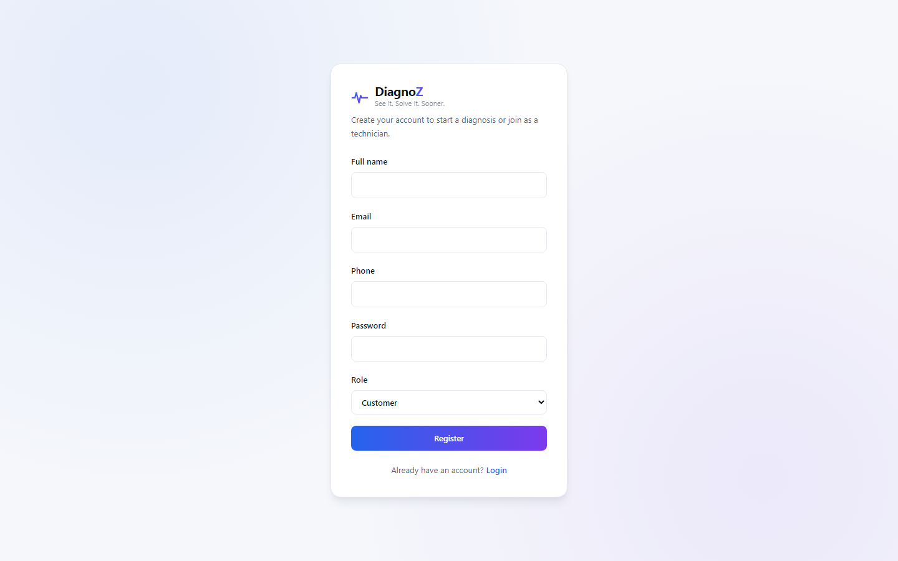

<div align="center">

# DiagnoZ

**See it. Solve it. Sooner.** Real-time video tele-diagnostic, voice AI triage & field
service dispatch platform for appliance repair — built to cut the 35–45% of technician
visits that are actually a tripped breaker, a loose connector, or a wrong setting.

[](backend/app/main.py)
[](backend/app/models/)
[](backend/app/services/spatial_matcher.py)
[](backend/workers/)
[](frontend/)
[](#measured-results)
[](#measured-results)

</div>

<p align="center">
  
</p>

<p align="center">
  <sub>Live diagnostic session — voice/video triage, real-time canvas annotation, and the AI assistant chat all in one view.</sub>
</p>

<p align="center">
  <a href="#how-it-works">How it works</a> ·
  <a href="#measured-results">Results</a> ·
  <a href="#quick-start">Quick start</a> ·
  <a href="docs/">Engineering notes</a> ·
  <a href="docs/DEMO_SCRIPT.md">Demo script</a>
</p>

---

## Overview

| | |
|---|---|
| **Backend** | FastAPI (ASGI), Python 3.12, Pydantic v2, SQLAlchemy 2.0, Alembic |
| **Data** | PostgreSQL 16 + PostGIS (spatial KNN dispatch), Redis 7 (locks, pub/sub, broker) |
| **Real-time** | Binary WebSockets — audio triage, WebRTC signaling, canvas annotation sync |
| **Async workers** | Celery + Celery Beat — HLS transcode, PDF invoices, weekly payouts |
| **Frontend** | React 19, Vite, served via Nginx in Docker |
| **Object storage** | MinIO / S3 — HLS segments, PDF invoices |
| **Infra** | Docker Compose (7 services) |
| **Evaluated** | 18 triage + 4 dispatch scenarios run against the live system, not mocks |

---

## Architecture



---

## How It Works

1. **Voice triage** — customer taps a mic and describes the fault in natural language. The
   browser streams raw 16kHz PCM binary chunks over `/ws/audio/triage` — no base64, no
   per-chunk string encode/decode. FastAPI runs streaming STT → an LLM with function-calling
   schemas (extracts `appliance_type`, `suspected_issue`, `urgency`) → streaming TTS, replying
   with spoken diagnostic feedback in under 500ms. Every stage has a deterministic offline
   fallback, so the full pipeline runs with **zero external API keys** — real providers plug
   into the same interface without changing the contract.
2. **Video diagnostic room** — customer points their phone camera at the appliance; the
   remote engineer draws arrows/circles on the live video. FastAPI brokers the WebRTC
   SDP/ICE handshake — media itself stays peer-to-peer; annotation coordinates are normalized
   to `[0.0, 1.0]` and broadcast over Redis Pub/Sub so they land correctly on any screen
   resolution.
3. **Reference video streaming** — troubleshooting guides stream via HTTP 206 Partial Content
   byte-range responses (`file.seek()`, never a full read) so a multi-GB file is never loaded
   into RAM; completed session recordings are transcoded to multi-bitrate HLS
   (1080p/720p/480p) by Celery workers.
4. **Geospatial dispatch** — if the issue can't be fixed remotely, a PostGIS K-Nearest-
   Neighbor query (`<->` operator, GIST index, EPSG:4326) finds the closest **available**
   technician within 5km — `O(log N)`, not a full table scan. A Redis distributed lock
   (`SET NX EX`) covers the race window between match and commit.
5. **Dual-OTP lifecycle** — `PENDING → ACCEPTED → (start_otp) → IN_PROGRESS → (end_otp) →
   COMPLETED`, cryptographically verified state transitions that prevent contractor
   start/complete fraud. OTPs are bcrypt-hashed; only the one-time API response ever carries
   the plaintext code.
6. **Settlement & reporting** — on completion, Celery compiles the inspection PDF
   (WeasyPrint) and books the ledger split: 15% platform commission, 85% technician payout
   minus 1% TDS. A weekly Celery Beat job settles payouts into technician wallets,
   idempotently.

---

## Dual-OTP dispatch lifecycle



Two independent guards, not one: the Redis lock only covers the *assignment* race; the
persistent `is_available` flag is what actually keeps a busy technician out of future KNN
matches. Verified end-to-end, including the concurrent-request 409 and the wrong-OTP 400 —
see [docs/PHASE_4_NOTES.md](docs/PHASE_4_NOTES.md).

---

## Measured Results

Not hand-waved — [`eval/run_eval.py`](eval/run_eval.py) runs 18 labeled triage transcripts and
4 labeled dispatch scenarios against the **real running system** (real DB, real PostGIS
queries, the real triage function) — no mocks.

| Metric | Result |
|---|---|
| Triage appliance-type accuracy | **100%** (18/18) |
| Triage urgency accuracy | **88.9%** (16/18) |
| Dispatch KNN precision | **100%** (4/4) |

### Two real bugs this eval process caught (both fixed)

1. **Substring-matching bug.** The keyword `"ac"` matched as a substring inside `"machine"`
   (as in "washing **mac**hine"), misclassifying washing-machine transcripts as `AC`.
   Appliance accuracy on the first real run: 83.3%. Fixed with a word-boundary regex match →
   **100%**.
2. **Eval-harness isolation bug** (not app code). The dispatch eval didn't isolate one
   scenario's fixture technicians from the next scenario's KNN query, so an earlier
   scenario's "available" technician kept winning later scenarios' matches. First run: **0%**
   precision. After isolating each scenario immediately after its assertion: **100%**.

The 2 remaining urgency misses are left as documented limitations of the offline keyword
fallback (no negation handling — *"nothing urgent **though**"* still matches `urgent`; no
non-English keywords), not silently special-cased. Full breakdown:
[docs/PHASE_EVAL_NOTES.md](docs/PHASE_EVAL_NOTES.md) ·
[docs/INTERVIEW_NOTES.md](docs/INTERVIEW_NOTES.md) (§3a).

---

## Screenshots

<p align="center">
  
  
</p>

<p align="center">
  <em>Dashboard with the impact stat and quick links &nbsp;·&nbsp; Dispatch Tracker — real PostGIS match + dual OTPs</em>
</p>

<p align="center">
  
  
</p>

<p align="center">
  <em>Technician Console — location, dispatch lifecycle, live annotation &nbsp;·&nbsp; Auth</em>
</p>

---

## API & WebSocket Surface

| Endpoint | Method | Purpose |
|---|---|---|
| `/api/v1/auth/register`, `/login`, `/me` | POST/GET | JWT auth, RBAC roles (CUSTOMER/TECHNICIAN/ADMIN) |
| `/api/v1/sessions` | POST/GET | Create & fetch a diagnostic session |
| `/api/v1/technicians/me/profile`, `/location`, `/availability` | POST/PATCH | Technician geo-profile management |
| `/api/v1/dispatch` | POST | KNN-match nearest technician, issue dual OTPs |
| `/api/v1/dispatch/{id}/accept`, `/verify-start-otp`, `/verify-end-otp` | POST | Dispatch lifecycle transitions |
| `/api/v1/videos/stream/{id}` | GET | HTTP 206 byte-range video streaming |
| `/ws/audio/triage/{session_id}` | WS | Binary PCM in → STT/LLM/TTS pipeline |
| `/ws/video/signal/{session_id}` | WS | WebRTC offer/answer/ICE relay |
| `/ws/canvas/sync/{session_id}` | WS | Normalized-coordinate annotation broadcast |

Interactive Swagger docs at `/docs` once the backend is running.

---

## Quick Start

Only Docker Desktop is required.

```bash
git clone <repo-url>
cd diagnoz
cp .env.example .env
docker compose up --build
```

Brings up 7 services: `db` (PostgreSQL + PostGIS), `redis`, `minio` (object storage),
`backend` (FastAPI, runs Alembic migrations on boot), `worker` (Celery), `beat` (Celery
scheduler), and `frontend` (React, served via Nginx which proxies `/api/` and `/ws/` to the
backend).

| Service | URL |
|---|---|
| Frontend | http://localhost:5173 |
| Backend API + Swagger docs | http://localhost:8000/docs |
| MinIO console | http://localhost:9003 |

### Local development (without Docker)

```bash
# Backend
cd backend
pip install -r requirements.txt
alembic upgrade head          # needs DATABASE_URL pointing at a Postgres+PostGIS instance
uvicorn app.main:app --reload

# Frontend (separate terminal)
cd frontend
npm install
npm run dev                   # defaults to VITE_API_BASE_URL=http://localhost:8000
```

Fastest path is usually a hybrid: `docker compose up -d db redis backend` for the backend
stack, then `npm run dev` in `frontend/` for a hot-reloading UI.

---

## Evaluation

```bash
docker compose up -d db redis backend
docker cp eval/run_eval.py <backend-container>:/app/run_eval.py
docker cp eval/scenarios.json <backend-container>:/app/scenarios.json
docker exec <backend-container> python run_eval.py
```

Runs against the real system, not mocks — see [eval/README.md](eval/README.md) for how the
dispatch eval isolates its own fixtures so it's safe to rerun against a shared/demo database.

---

## Project Structure

```
backend/
  app/
    api/v1/endpoints/   REST routes: auth, sessions, technicians, dispatch, streaming
    core/               config, DB engine/session, JWT+bcrypt security, RBAC deps
    models/             SQLAlchemy models with PostGIS geometry columns
    schemas/            Pydantic request/response models
    services/           whisper_client, llm_triage, tts_client (offline-first),
                         spatial_matcher (PostGIS KNN + Redis lock)
    websockets/         audio_triage, canvas_sync, webrtc_signaling
    main.py             FastAPI app + router wiring
  workers/
    celery_app.py       Celery app + Beat schedule
    storage.py           S3/MinIO helper
    tasks/               media_transcode (FFmpeg HLS), report_generate (WeasyPrint PDF),
                         payout_settle (weekly wallet settlement)
  alembic/              DB migrations
frontend/
  src/
    components/         AppShell, Logo, HeroBanner, AudioTriageWidget, AnnotationCanvas
    hooks/               useAuth, useWebSocket, useAudioRecorder
    pages/               Dashboard, Login, Register, CustomerRoom, TechnicianConsole,
                         DispatchTracker
    lib/api.js           Single fetch wrapper for the whole backend surface
eval/                   scenarios.json + run_eval.py — measured accuracy/precision numbers
docs/                   Setup guide, technical spec, roadmap, per-phase build notes,
                         interview prep, demo script, screenshots
```

---

## Engineering Notes

Every phase is documented with what was built, how it was verified against the real running
system, and the real bugs found along the way — including the ones that turned out to matter.

| | |
|---|---|
| [docs/TECHNICAL_SPEC.md](docs/TECHNICAL_SPEC.md) | Full architecture, DB schema, WebSocket contracts |
| [docs/ROADMAP.md](docs/ROADMAP.md) | Phase order, current status, deployment plan |
| [docs/CODE_NOTES.md](docs/CODE_NOTES.md) | File-by-file "what and why" for every module |
| [docs/PHASE_1_NOTES.md](docs/PHASE_1_NOTES.md) … [PHASE_5_NOTES.md](docs/PHASE_5_NOTES.md) | Per-phase build notes |
| [docs/PHASE_FRONTEND_NOTES.md](docs/PHASE_FRONTEND_NOTES.md) | Frontend build + real-browser verification |
| [docs/PHASE_EVAL_NOTES.md](docs/PHASE_EVAL_NOTES.md) | Evaluation harness methodology and results |
| [docs/INTERVIEW_NOTES.md](docs/INTERVIEW_NOTES.md) | Pitch, ROI numbers, trade-offs, measured results, anticipated Q&A |
| [docs/DEMO_SCRIPT.md](docs/DEMO_SCRIPT.md) | Step-by-step live demo walkthrough — exact clicks, what to say, fallback plan |

---

## Not Built

Stated plainly rather than implied:

- **Live deployment** — everything above is verified against `docker compose` on a local
  machine. A free-tier deploy plan (Neon + Upstash + Render + Vercel) is written up in
  [docs/ROADMAP.md](docs/ROADMAP.md), but nothing is hosted publicly yet.
- **Real WebRTC media, browser-to-browser** — the signaling broker (`/ws/video/signal`) is
  implemented and verified (two clients correctly relay an SDP offer), but an actual
  peer-to-peer video call between two real devices, including a TURN server for strict NAT,
  has not been run.
- **Real STT/LLM/TTS providers** — every voice-pipeline stage has a working, verified
  offline fallback so the full flow runs with zero API keys. Wiring in a real Whisper/GPT/
  TTS provider behind the existing interface is a config change, not an architecture change,
  but it hasn't been done.
